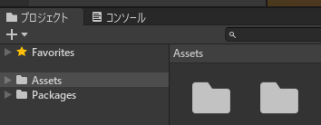
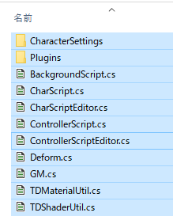
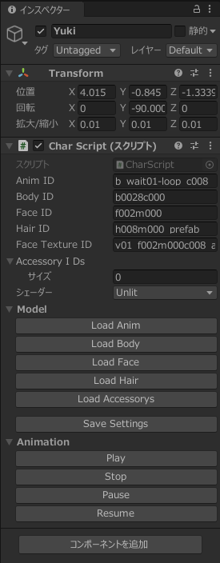

# TDViewer
`com.square_enix.android_googleplay.PTD`の3Dモデルを読み込みUnity Editorに表示します。


必要なもの：

* Unity 2019.4以上
* ゲームのデータ(`/sdcard/Android/data/com.square_enix.android_googleplay.PTD/files/prim`)
* Newtonsoft Json.NET(同梱 13.0.1 .NET Standard 2.0)
* [UnityChanToonShader](https://github.com/unity3d-jp/UnityChanToonShaderVer2_Project/releases/tag/legacy-2.0.8) (オプション)

## プロジェクトの準備
Unityで新規プロジェクト 3D(コア)を作成。


src以下のファイルを全て選択して、プロジェクトのAssetsにDrag&Drop。





UnityChanToonShaderを使う場合は、別途DLした`UTS2_ShaderOnly_v2.0.8_Release.unitypackage`もD&D。


### オリジナルのシェーダーを使う場合(Windowsのみ？)
「編集」→「プロジェクト設定」→「Player」→「PC,Mac & Linux Standalone の設定」  
「その他の設定  」
「自動グラフィックス API for Windows」をアンチェック。  
「Graphics APIs for Windows」の1番上に 「OpenGLES2」を設定する。  


Unity Editorを再起動。  
家の環境ではOpenGLES2に設定したら暗くなった。  
その他の設定→色空間をガンマに設定。

オリジナルのシェーダーを使った場合、シーンビューがIsoでは正常に表示されません。
Perspを選んでください。


## モデルの表示
左のヒエラルキーのSampleSceneで右クリックして、「Create Empty」で空のゲームオブジェクトを作ります。

作ったゲームオブジェクト名を右クリックして「rename」を選び名前をSakuraにします(サクラ用)。

Sakuraを選択した状態で、右側のインスペクターの
Add Component(コンポーネントを追加)を押します。

Script ->  Char Script を選び、CharScriptコンポーネントを追加します。
シェーダーを変えたい場合はシェーダーを変更しておきます。



▷再生ボタンを押します。
`Assets/prim_dir.txt`が無ければ、ファイルダイアログが開きます。ゲームデータのあるディレクトリを指定してください。

インスペクターのLoad Animボタンを押し、Playボタンを押すとアニメーションが再生されます。

各ID(ファイル名)を変更してLoad *ボタンを押すと指定したファイルを読み込みます。

ControllerScriptをアタッチして、インスペクターのPlay Allボタンを押すと、すべてのゲームオブジェクトを再生できます。

※Unityで再生中に変更した設定は基本的に破棄されます。

## 設定ファイル
### ゲームデータのパスの指定
プロジェクトのAssetsにprim_dir.txtがあれば、そこで指定したパスから読み込みます。
設定例：`D:\game\dolls\gamedata\files\prim`

### 3Dモデルのファイル指定
`Assets/CharacterSettings`
にある`ゲームオブジェクト名.json`で読み込むモデルのファイルを設定します。
同名のゲームオブジェクト(例： Aya)を作成して、コンポーネントを追加してください( Script -> CharScript)

`Aya.json`
```
{
"anim":"b_wait01-loop_c007",
"body":"b0028c000",
"face":"f002m000",
"hair":"h007m000_prefab",
"faceTexture":"v01_f002m000c007_a",
"accy0":"i7003_A",
"accy1":"i7003_B"
}
```

* anim: アニメーションファイル名
* body: 3Dモデル(体)のファイル名
* face: 3Dモデル(顔)のファイル名
* faceTexture: テクスチャ(顔)のファイル名
* hair: 3Dモデル(髪)のファイル名
* accyS: 3Dモデル(アクセサリー)のファイル名。※キーが重複しなければ複数可。Sは任意の文字列(例: 1)

* ※ファイル名の拡張子(.abap)はあっても動きます。
* ※メガネ、イヤリング以外のアクセサリーは、位置を決めるため`Assets/CharacterSettings/accessory_dic.json` にボーンとの対応を記入する必要があります


## 備考


## 制限事項
* ビルド不可。Editorでのみ利用可
* 物理演算なし
など


## アセットファイル名

* アニメーションファイル名一覧 anim_filenames.csv
* 3Dモデル(体)ファイル名一覧 body_filenames.csv
* 3Dモデル(髪)ファイル名一覧 hair_filenames.csv
* 背景ファイル名一覧 bg_filenames.csv_
### 3Dモデル
#### 髪
`h(キャラクターID)m(数字)_prefab.abap`

#### 顔
`f(数字)m(数字).abap`

#### 体

```b(数字)c(キャラクターID).abap```


専用モデル以外のキャラクターIDは `000`。

### アニメーション
```b_(*).abap```

#### 撮影モードモーション
```b_photo-common-mot(数字).abap```

#### 撮影モードポーズ
```b_photo-common-pose(数字).abap```

#### スキル
```b_skill-ur(*)-(*).abap```

